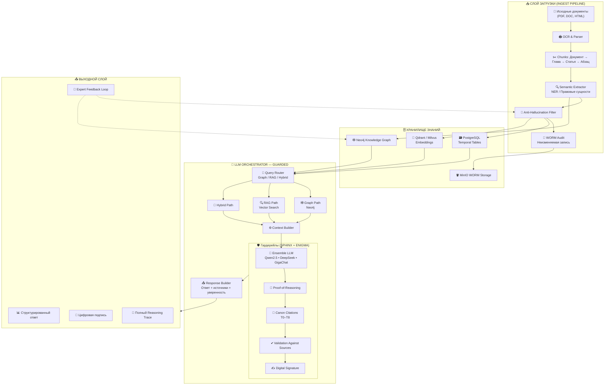

# 🧠 MIND FORGE — KNOWLEDGE CORE  
## 🚀 Универсальная фабрика знаний + безопасный LLM оркестратор


---

## 🎯 Что это за проект?
**MIND FORGE — KNOWLEDGE CORE** — это первая в мире безопасная модульная платформа, способная:

### 🔹 Автоматически поглощать нормативные документы  
(законы, ГОСТы, стандарты, отраслевые требования)

### 🔹 Разбивать их на атомарные требования  
(до уровня «один закон → одно требование → один нейрон»)

### 🔹 Строить живую графовую базу знаний (Neo4j)  
с весами, ссылками, доказательствами и версиями документов.

### 🔹 Генерировать **политики, регламенты, инструкции, отчёты**, полностью валидированные нормативкой.

### 🔹 Работать через **LLM-оркестратор с SPHINX + ENIGMA**  
(анти-галлюцинации, доказательная логика, цифровая подпись ответа).

---

# 🏛 Архитектура уровня государства


```
📁 Структура репозитория
KNOWLEDGE_CORE/
├── 00_CONTRACTS/          # Формальные спецификации протоколов
├── 01_CANON/              # Нормативный Canon T0–T8
├── 02_KNOWLEDGE_GRAPH/    # Узлы, связи, весовые модели
├── 03_EXTRACTORS/         # Модели извлечения норм
├── 04_REASONING/          # SPHINX + ENIGMA — ядро логики
├── 05_DIFF_ENGINE/        # Разница версий законов
├── 06_TEMPLATES/          # Шаблоны документов, узлов, связей
├── 07_PROMPTS/            # Промпт-стандарты MF-PROMPT-v1.1
├── 08_TESTS/              # Автотесты модели и консистентности
│
├── DOCS/                  # Документация
│   ├── ARCH/              # Архитектура
│   ├── SPEC/              # Спецификации
│   ├── SEC/               # Модели безопасности
│   ├── COMPLIANCE/        # Соответствие: ФСТЭК | ФЗ | ISO | NIST
│   ├── API/               # API эндпоинты
│   └── POLICIES/          # Политики ИБ, SOC, DLP, КИИ
│
├── MF_DEVSECOPS/          # CICD, Security pipeline
└── README.md              # Этот файл
```
🔐 Zero Trust + Compliance

Платформа реализует:

Требование	Статус
152-ФЗ	✔ Полная поддержка
187-ФЗ (КИИ)	✔ Контроли, журналы, реакции
ФСТЭК 239/235	✔ Шаблоны и автоматическое выполнение
ISO 27001 / 27005	✔ Mapping встроен
NIST SP 800-53 / 800-63	✔ Частичное покрытие
GDPR / HIPAA	⏳ В разработке
🤖 Поддерживаемые модели
Назначение	Модель
Основная LLM	Qwen2.5 14B
Кодогенерация	DeepSeek Coder
Сложные рассуждения	GigaChat 20B
Голосовые документы	Whisper
Векторный поиск	BGE-m3
🧩 Основные возможности
✔ Автоматическая генерация:

Политик ИБ

Процедур реагирования

Риск-моделей

Актов расследования инцидентов

Политик КИИ

Политик ПДн

✔ Полная трассировка рассуждений:

Что взято из какого закона

Почему модель сделала вывод

Какой контроль закрывает требование

✔ Анти-галлюцинация (уровень банка / госкомпании)

подтверждение каждого факта

отказ от ответа без доказательств

цифровая подпись reasoning

🛣 Дорожная карта
🔹 Q1 2026

✔ Canon T0–T4
✔ Knowledge Graph v1
✔ SPHINX Reasoning Firewall
✔ ENIGMA Logic Validator

🔹 Q2 2026

⬜ Автоматическая генерация комплекта документов ИБ
⬜ Поддержка отраслей: медицина, финансы, промышленность
⬜ LLM-плагин VSCode / JetBrains

🔹 Q3 2026

⬜ Многопользовательская версия
⬜ SaaS-платформа
⬜ Marketplace модулей нормативки

📜 Лицензия

Проект распространяется под лицензией Apache 2.0
(можно менять на GPLv3 / MIT — скажи какую ставим).

🌐 GitHub Pages / Инвесторский сайт

Готов развернуть сайт:

Docusaurus (корпоративный)

MkDocs Material (технический)

Custom HTML Landing (маркетинговый)
